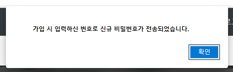
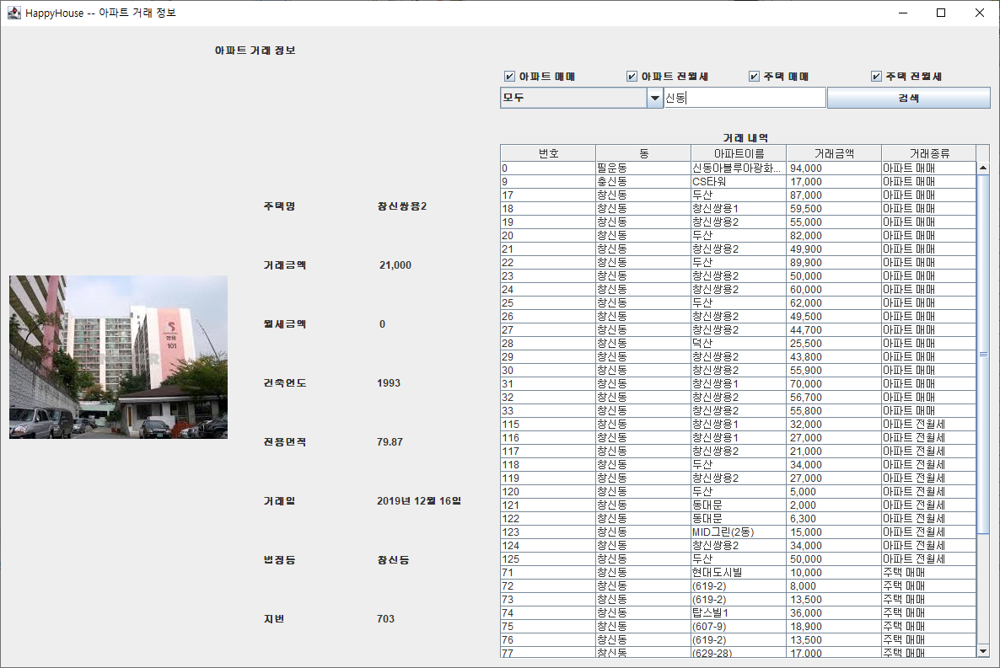
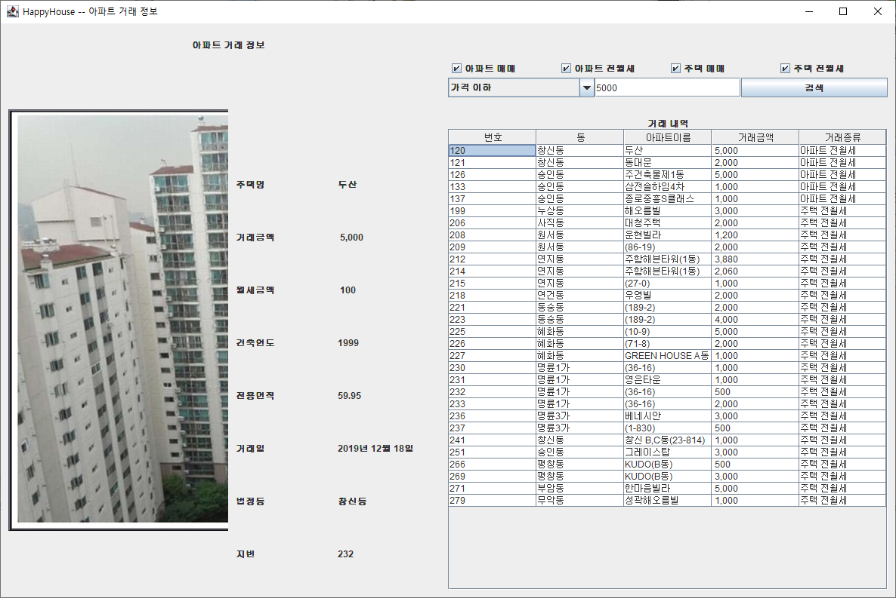

### 비밀번호 해싱 ###

##### SHA-256 해싱기법을 이용 #####
 - SHA-256은 다이제스트 출력 값이 256bit인 해싱기법으로, 항상 동일한 입력값에 같은 출력값을 제공한다.
 - 각각의 출력값의 경우의 수는 2^256이라는 어마무시한 경우의 수를 제공하여 충돌 가능성이 매우 적다.
 - 해싱된 결과값을 가지고 복호화가 사실상 불가능하다.
 - 그렇기에 비밀번호를 해싱하면 관리자나 혹은 그 외의 사람이 DB에 접근하여도 원본 비밀번호를 알아낼 수가 없다.
 - 혹여나 비밀번호가 같은 경우, 같은 결과값이 나오기 때문에 비밀번호를 알 순 없어도 동일한 해싱값인 경우 동일한 비밀번호를 사용함을 유추할 수 있다.
 - 따라서 salting 방법으로 비밀번호+아이디+가입날짜 로 문자열을 해싱하여 저장한다. 
 - RSA는 공개키 방식의 알고리즘으로 암호화와 복호화의 과정이 무겁고, 저장할 값이 많아 다량의 데이터를 저장하는데 적합하지 않다고 판단하여 선택하지 않았다.
 - MD5를 이용한 해싱방법은 해시 충돌이 자주 일어나며, 이 알고리즘의 결함을 이용하여 SSL 인증서를 변조하는 것이 가능하다고 발표되어 현재는 보안 관련으로 이용하는 것은 적합하지 않다.
 

##### 비밀번호 찾기 기능 제거 및 변경으로 수정 #####
 - 비밀번호를 해싱하여 저장하기 때문에 더 이상 원래의 비밀번호를 알 수는 없음.
 - 그래서 휴대폰 문자를 통해 신규 비밀번호를 발급하여 전송해준다.

　  
　  
　  
　  

##### 특정 편의시설들이 주변에 존재하는 아파트 목록 검색 #####

사용자가 편의 시설을 선택하여 검색하면 조건을 만족하는 

ex) 편의시설 종류

    상위 종류 : 식음료, 추천 활동, 쇼핑, 서비스
    - 식음료 : 음식점, 테이크아웃,바,배달,커피 
    - 추천 활동 : 공원, 라이브음악, 체육관, 영화, 예술, 박물관 ...
    - 쇼핑 : 식료품 ...
    - 서비스 : 호텔, 주유소 ...

###### 만들 알고리즘 개요 ######
1) 동 기준으로 아파트 목록을 얻어옴
2) 사용자가 편의시설 종류 다중 선택 (최대  7개) 및 검색
3) 첫번 째로 선택된 편의시설과 아파트 사이의 거리를 계산하여 특정 거리 내에 존재하는 아파트만 리스트에 담음
4) 각 리스트에 담긴 아파트가 그 다음 편의 시설과 특정 거리 내에 존재하지 않으면 리스트에서 뺌
5) 최종적으로 남은 리스트를 결과로 보여줌

아파트 : N개(동 내 아파트 개 수) 선택된 편의시설 종류 : M개 (1~7) 각 편의시설 최대 수 : k개

예상 최악의 시간 복잡도 : O(N * M *k) 
　  
　  
　  
　  

#### 편의시설 최단거리 계산 알고리즘 ####
 - 최단거리는 각 위치의 x,y 좌표를 기준으로 하여 구한 대각선 길이가 아닌 실제 도로를 통해 가게 될 경우의 거리를 계산한다.
 - 도로 정보는 api를 통해 받아온다.

##### 알고리즘 ######
 사용할 수 있는 알고리즘은 DFS와 BFS가 있지만, BFS가 더 적합한 상황이므로 BFS를 사용
 
 BFS 알고리즘 중에서 고려한 알고리즘은 다음 4개이다.
 
   1) Bidirectional breadth-first search
   2) Dijkstra's algorithm
   3) Best-first search
   4) A* search

##### 1) Bidirectional breadth-first search ######
 1. 출발 지점과 목표 지점에서 동시에 번갈아가면서 길 찾기를 실시한다.
 2. 만나는 순간 길을 찾은 것으로 한다.

##### 2) Dijkstra's algorithm ######
 1. 공간을 노드로 나눈 후 가중치를 두어 계산한다. (도보로 계산하는 가중치는 모두 같다)
 2. 가중치의 합이 가장 작은 경로를 구한다.
 3. 공간을 모두 노드화 하려면 메모리도 많이 사용하게 되고, 탐색해야 하는 공간도 그에 맞춰 커져서 시간 복잡도도 커지게 된다.
 4. 그렇기에 현실 적용이 어렵다

##### 3) Best-first search ######
 1. 단순하게 거리가 가장 짧은 노드를 확장하여 탐색하는 방법
 2. 항상 최적의 해를 내놓지는 않는다.
 3. 휴리스틱

##### 4) A* algorithm  ######
 1. 다익스트라 알고리즘에 휴리스틱을 넣어서 최단 거리를 낸다.
 2. 현재 상태에서 다음 상태로 이동할 때 현재 비용과 다음 이동 비용의 최소치가 되는 점을 우선적으로 탐색한다
 3. 항상 최적의 해를 내놓지는 않지만 근사값을 찾아낸다.
 4. Best-first search 의 방법보다 정확하며 다익스트라의 방법보다는 빠르다.

그렇기에 A* 알고리즘을 통하여 경로를 구한다.
A* 알고리즘을 통해 나온 경로와 거리를 출력하여 편의시설과 아파트 사이의 거리를 나타낸다.
　  
　  
　  
　  

#### 검색 알고리즘 개선 여부 ####
 - 검색 알고리즘 구현 시 KMP 알고리즘을 통해 문자열을 비교하면 상대적으로 더 빠른 시간에 확인이 가능하다.
 - 하지만, 문자열이 짧은 경우에는 오히려 KMP 알고리즘을 구현하면서 메모리 할당과 시간이 더 많이 걸려 불리하다.
 - 그래서 본 프로젝트에서는 검색이 주로 아파트 이름 혹은 지역 이름 등 짧은 문자열이므로 채택하지 않기로 하였다.
 - 대신 검색 옵션에 모두를 선택할 시, 아파트 이름 뿐만 아니라 동 이름도 같이 검색하여 결과물을 출력하도록 한다.
 - 선택한 상단부 옵션(아파트/주택 매매, 전세 여부)에 따라서 결과물도 바뀐다. 

예시 이미지) 
예시 이미지) 
　  
　  
　  
　  

#### 폐수시설 정보 출력 알고리즘 ####
 1. 아파트 근처의 폐수시설의 개수를 db에서 받아와서 정보를 아파트를 검색할 시에 같이 보여준다.
 2. 이 때 폐수시설에 관한 정보가 15000개여서 for문을 돌리게 될 시에 프로그램에 영향을 준다.
 3. 따라서 for문을 사용하는 대신 HashMap에 동을 key 값으로 저장하여 폐수시설 개수를 mapping시켰다.
 4. 이렇게 구현하여서 연산처리를 줄여주었다.

　